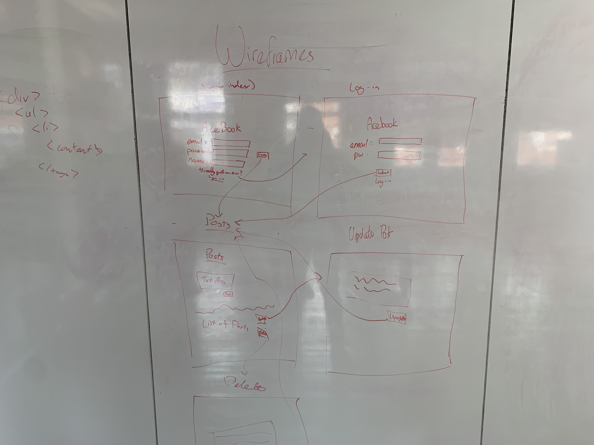

[](https://travis-ci.org/davmcgregor/acebook-off-the-rails)
[](https://codeclimate.com/github/davmcgregor/acebook-off-the-rails/maintainability)
[](https://codeclimate.com/github/davmcgregor/acebook-off-the-rails/test_coverage)

### [Makers Academy](http://www.makersacademy.com) - Week 8/9 Team programming challenge 

# AceBook 👍

Link to App - https://offtherails-acebook.herokuapp.com/

#### Technologies: Ruby, Rspec, Capybara, Rails, HTML, CSS, TravisCI, CodeClimate

[Task](#Task) | [Collaborators](#Collaborators) | [Installation Instructions](#Installation) | [User Stories](#User_Stories) | [Mockup](#Mockup) | [Further improvements](#Further_Improvements)


## <a name="Task">The Task</a>

Build a facebook clone using Rails that allows users to sign up, log in and make posts.

This challenge is the second team programming challenge at [Makers Academy](https://github.com/makersacademy).

## <a name="Collaborators">Collaborators</a>

* [Elena Beccaro](https://github.com/elebecca)
* [Richard Pattinson](https://github.com/richardpattinson)
* [Ziad Soobratty](https://github.com/zsoobratty)
* [Toby Dawson](https://github.com/tobydawson1)
* [David Stewart](https://github.com/DavidStewartLDN)
* [David McGregor](https://github.com/davmcgregor)

## <a name="Commands following Pull Request">Pull Request Instructions</a>

After pulling from the maser repository. If there are database changes then:

```bash
> bin/rails db:drop
> bin/rails db:create
> bin/rails db:migrate
```

## <a name="Installation">Installation Instructions</a>

First, clone this repository. Then:

```bash
> bundle install
> bin/rails db:create
> bin/rails db:migrate

> bundle exec rspec # Run the tests to ensure it works
> bin/rails server # Start the server at localhost:3000
```
To run tests:
```bash
> rspec # Run the tests
> rubocop # Check code quality
```

## <a name="User_Stories">User Stories</a>

### MVP 

```
As a user,
So I can log into Acebook,
I would like to create an account
```
```
As a user,
So that I don't accidentally type in the wrong email,
I would like an error message if I type a non-valid email
```
```
As a user,
So my account is secure,
I would like to enter a password of 6-10 characters
```
```
As a user,
To use the site,
I would like to be redirected ot posts after logging in/signing up
```
```
As a user,
So that only I can post stories with my ID,
I want users that are not logged in to be directed to log in
```
```
As a user,
So I prove my identity,
I want to be able to enter my email and passwords
```
```
As a user,
To share what I'm up to,
I would like to be able to make a post
```
```
As a user,
In order to correct mistakes,
I would like to be able to edit my posts up to 10 mins after they were created
```
```
As a user,
So I can't update/delete other peoples posts (like an idiot),
I would like to see a helpful error message
```
```
As a user,
To know the context of a post,
I would like to see the date, time and author of a post
```
```
As a user,
So I can be kept up to date,
I would like to see the most recent posts first
```
```
As a user,
So that my posts are easy to read,
I would like to be abe to make posts using line breaks
```

### Additional features

```
As a user,
So I can see my wall,
I want be redirected to my wall when I log in
```
```
As a user,
So I can see other user’s walls,
I want to be able to access other user's walls
```
```
As a user,
So I need to prove that I’ve an account, 
I can’t see other user’s walls if I don’t log in
```
```
As a user,
So I can see others users walls,
I need to be logged in to see other user’s walls
```
```
As a user,
So I can post on any user’s wall,
I want that post to appear only on that user’s wall
```
```
As a user,
So anyone can’t change a post, 
I can’t update or delete posts or comments that are not mine.
```

### Bonus features

```
As a user,
If I don’t have an account,
I want to be redirected to a custom 404 page with a message saying that the user doesn't exist.
```
```
As a user,
To access my account,
I want my username be used to form the URL 
```
```
As a user,
So I can personalize my wall,
I want be able to choose between two or more different fonts and background colors
```

## <a name="Mockup">Mockup</a>



## <a name="Further_Improvements">Further Improvements</a>

* Styling
* More features


