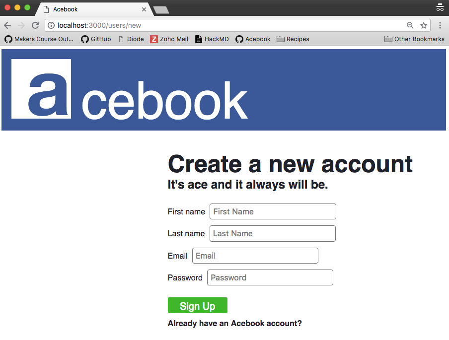
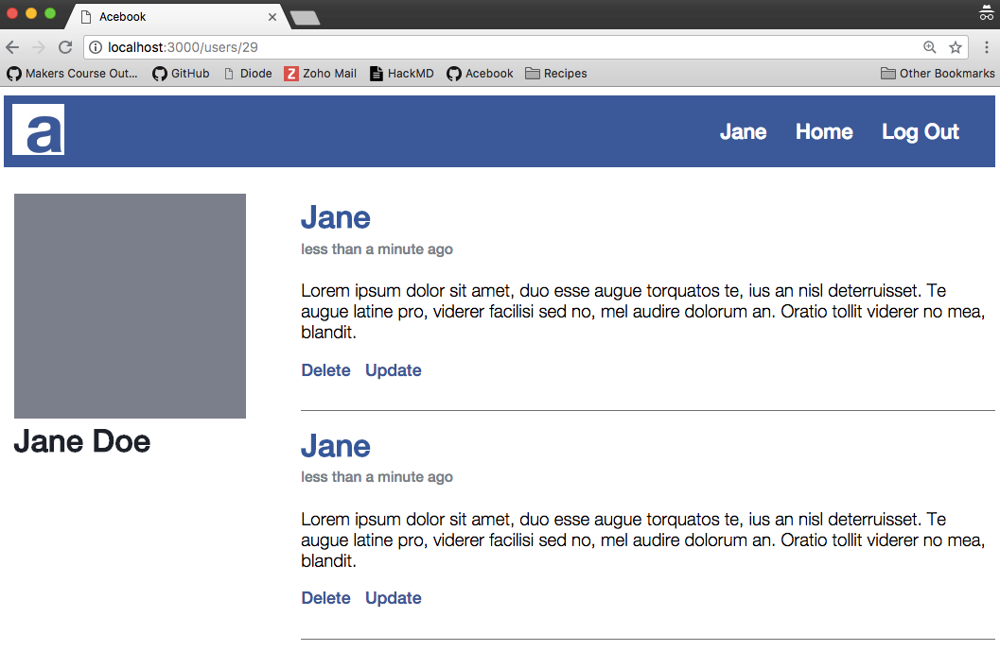
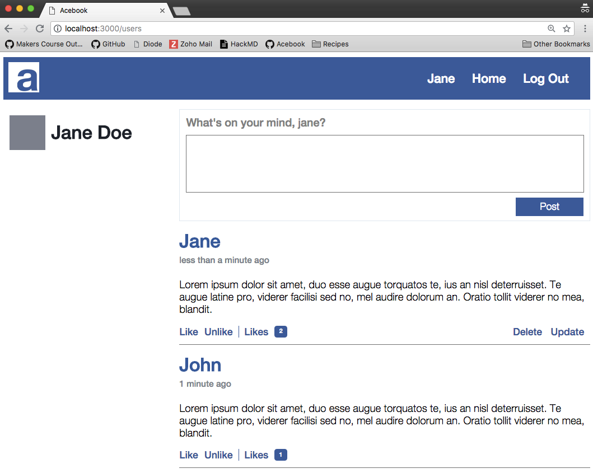

# Acebook

[](https://travis-ci.org/jeff1108/acebook-rails-keeping-it-rails)
[](https://codeclimate.com/github/jeff1108/acebook-rails-keeping-it-rails/test_coverage)
[](https://codeclimate.com/github/jeff1108/acebook-rails-keeping-it-rails/maintainability)

## Summary

Week 8 and 9 Makers Academy "Engineering Project" to develop a Facebook clone, called Acebook.

This project is designed to simulate a real-world development environment.

Our focus is on learning to use high-quality processes* to build a project in a team.

*Agile Methodologies, Git Workflow, Pair Programming, Continuous Integration
___

## Technical

### Tech/Frameworks Used

- **Framework** - Ruby on Rails
- **Testing** - RSpec, Capybara, Simple Coverage
- **Code Quality** - Rubocop, Code Climate
- **Continuous Integration** - Travis CI
- **Deployment** - Heroku
- **Version Control** - GitHub

### Our Documentation
- __How we [use Git as a team](https://hackmd.io/Rg0cJ_UoTSSHRF6SIgklnA?view)__
- __How to set up [Heroku on Rails](https://hackmd.io/Z1-fDKccQxuCSeyxDZ9lRg)__
- __How to install [Travis on Rails](https://hackmd.io/gQXa22dWQ-a8WZ9K5rArrQ)__


### Launching the Application


__You can run the application on your local machine by following these steps:__  

```
$ git clone https://github.com/jeff1108/acebook-rails-keeping-it-rails.git
$ cd acebook-rails-keeping-it-keepingitrails
$ bundle install
$ rails s
```

In your browser, navigate to `localhost:3000`

__Alternatively a [demo site is deployed onto Heroku](https://acebook-keeping-it-rails.herokuapp.com/).__

___

## Screenshots







____

## Credits

Developed in 10 days by [Daniel Lau](https://github.com/dct-lau17), [Elishka Flint](https://github.com/elishkaflint), [Jeff Hung](https://github.com/jeff1108) and [Jay Khan](https://github.com/neobay991).

Reflections on process and learnings from this project can be found [here](https://hackmd.io/-5Q6g-SnQqaELTfrZjOP0w?both).

___

## User Stories:

### Implemented in the first sprint (MVP)

```
As a user,
So that I can use Acebook,
I want to be able to sign up for an account
```
```
As a user,
So that I can post on Acebook,
I want to be able to add some text to my homepage
```
```
As a user,
So that I can see what's going on,
I want to be able to see other people's posts on my homepage
```

### Implemented in the second sprint

```
As a user,
So that I can come back to Acebook again and again,
I want to be able to sign in and out.
```
```
As a user,
So that I can keep track of my activity,
I want to be able to view my own profile with my posts only
```
```
As a user,
So that I can curate my content,
I want to be able to update and delete my posts
```

### Implemented in the third sprint

```
As a user,
So that I can show appreciation,
I want to be able to like a post.
```
```
As a user,
So that I can see how successful my posts are,
I want to be able to see who has like my posts.
```
```
As a user,
So that I can correct erroneous appreciations,
I want to be able to unlike a post.
```
___
