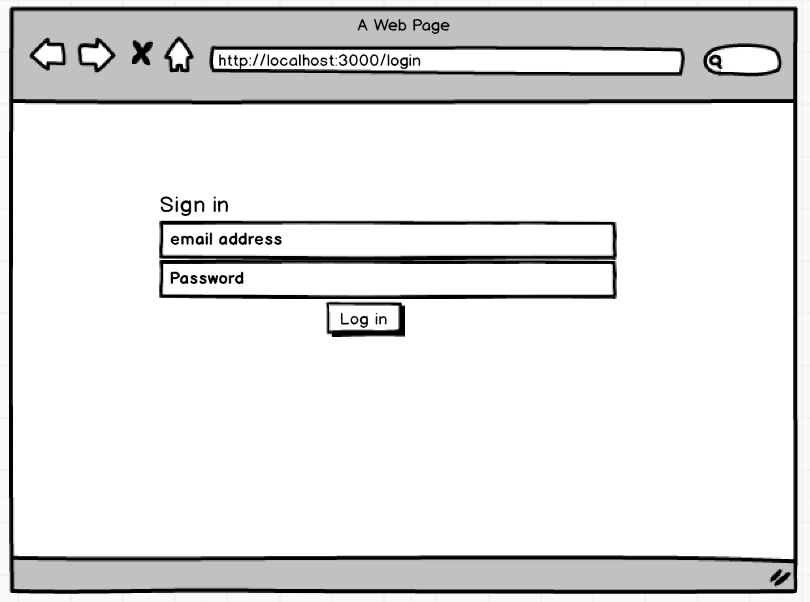
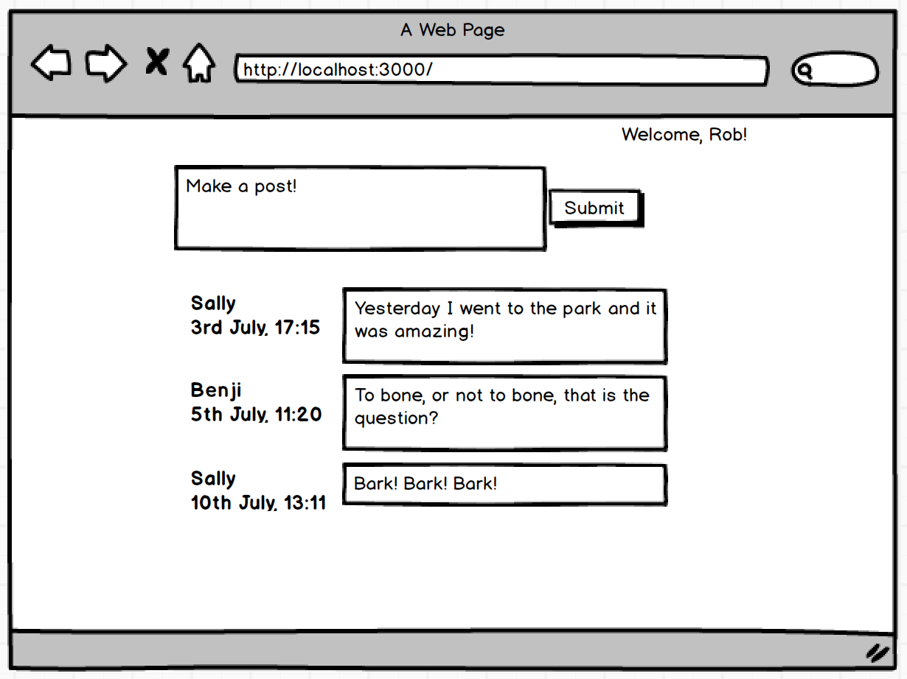

# AceBook

Fork this repository to `acebook-teamname` and customize
the below**

[You can find the engineering project outline here.](https://github.com/makersacademy/course/tree/master/engineering_projects/rails)

The card wall is here: <please update>

## How to contribute to this project
See [CONTRIBUTING.md](CONTRIBUTING.md)

## Quickstart

First, clone this repository. Then:

```bash
> bundle install
> bin/rails db:create
> bin/rails db:migrate

> bundle exec rspec # Run the tests to ensure it works
> bin/rails server # Start the server at localhost:3000
```


## MVP




User Stories<br>

As a pet I can see a welcome message, so that I know I'm logged in.
As a pet, I can see my name next to my post, so that everyone knows it's me (small)
As a pet, I can post text to the newsfeed so that I can share my drivel (small)
As a pet, I can see the timestamp of my post, so people know what's most recent (small)
As a pet I need to login to Petbook so I can post as myself (medium)
As a pet, I can see posts in reverse chronological order, so that other pets see the most recent posts first (small)
As a pet, I can see other pets' previous posts so I can see what they're saying (medium)
