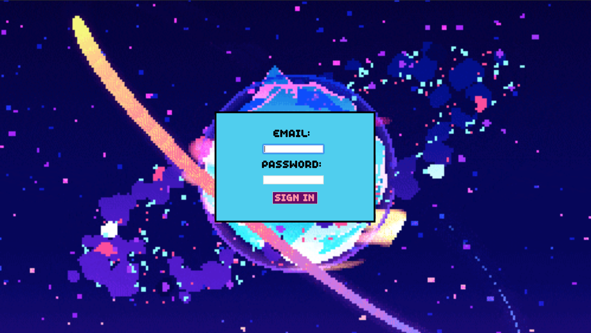

[](https://travis-ci.org/fetc90/acebook-Spacebook)
[](https://coveralls.io/github/fetc90/acebook-Spacebook/?branch=master)
[](https://codeclimate.com/github/codeclimate/codeclimate/test_coverage)
[](https://codeclimate.com/github/codeclimate/codeclimate/maintainability)

# Welcome to Spacebook

A clone of the Earthly Facebook. Follow the link to see our deployed app [on Heroku](https://acebook-spacebook.herokuapp.com/).


## Screenshots



## Quickstart

First, clone this repository and navigate to the project root directory. Then:

```bash
> bundle install
> bin/rails db:create
> bin/rails db:migrate
> bin/rails server # Start the server at localhost:3000
```

## How to use

- Click the sign up button to create a profile
- Fill in your details and click submit

- When you are redirected, click the sign in button

- You can now:
  - post on your own wall
  - visit the main feed
  - click on people's names to visit their wall
  - leave posts on other user's wall
  - edit posts you have created (within ten minutes)
  - delete posts you created
  - if you try and visit someone's wall by typing their id in the url, you are greeted with this friendly space citizen:


  


## Running Tests

We used RSpec and Capybara as our testing framework and Coveralls to ensure a high test coverage throughout development.
```
> bundle exec rspec # Run the tests to ensure it works
```


## Approach

We approached to this project in an agile way by doing 2-day sprints with standups in the morning and retros at the end of each sprint. We also documented our workflow throughout:
- We also documented our approach in a [setup file](APPROACH.md).
- We broke down our user stories into tickets on a [tream Trello](https://trello.com/b/qyOCSER0/acebook-spacebook) board and assigned ticket to pairs and made sure we rotated pairs halfway-through the day whilst keeping one member who is familiar with the codebase on the same ticket. This ensured that we all became familiar with the codebase.
- We [recorded](https://docs.google.com/spreadsheets/d/1qxLmJjrPnSIZuI13EKJS4rV3SMt9_AptxTFiOTG-7GU/edit?usp=sharing) our standup and retros in an execl sheet to keep track of progress on the project.
- We made a blog about our progress throughout this project. You can view that [here](https://medium.com/@spacebook3000).

## How to contribute to this project
See [CONTRIBUTING.md](CONTRIBUTING.md)

## Authors' Details

Co-authored-by: LisaMcCormack <lisamccormack85@gmail.com>  
Co-authored-by: fetc90 <francescachater@gmail.com>  
Co-authored-by: yem82 <yemiadebayo60@gmail.com>  
Co-authored-by: n3ttl3t <n3ttl3t@gmail.com>  
Co-authored-by: LaurenceTaylor <ltaylorapp@gmail.com>  
Co-authored-by: hughbric <mhughes36@live.co.uk>  
