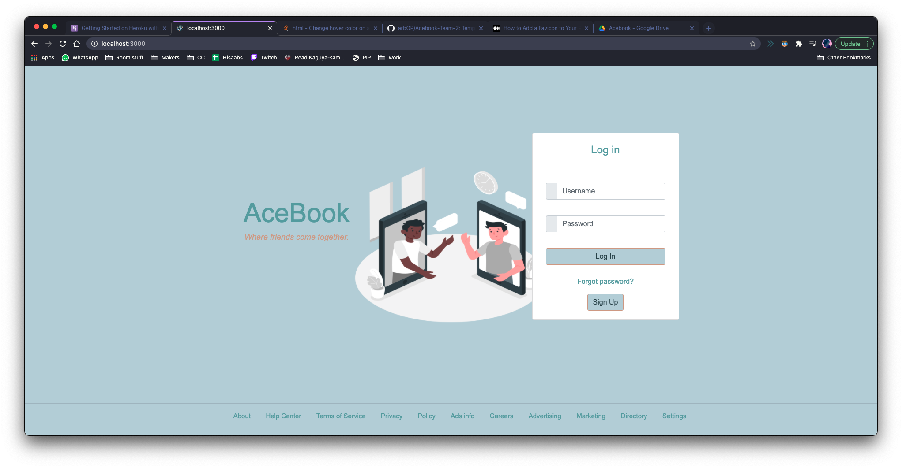

[](https://codeclimate.com/github/DanGyi23/acebook-rails-template-railz-rude-boiz/maintainability) [](https://codeclimate.com/github/DanGyi23/acebook-rails-template-railz-rude-boiz/test_coverage)
# Acebook - READEME

An original social networking application developed in rails

## Getting Started

These instructions will get you a copy of the project up and running on your local machine for development and testing purposes.

### Prerequisites

Ruby version 2.6.3 is used. To check which version of Ruby you have installed
```
$ ruby -v
```

Rails version 6.0.0 is used. To check which version of Rails you have installed
```
$ rails -v
```

### Installing

To get a development env running:

Install ImageMagick to handle profile images in the program
```
$ sh -c "$(curl -fsSL https://raw.githubusercontent.com/Linuxbrew/install/master/install.sh)"  - brew install ImageMagick
```

Install gems

```
$ bundle install
```

Create local database with postgresql
```
$ rails db:migrate
```

Start local server and visit localhost:3000 in browser to view Acebook homepage
```
$ rails server
```


