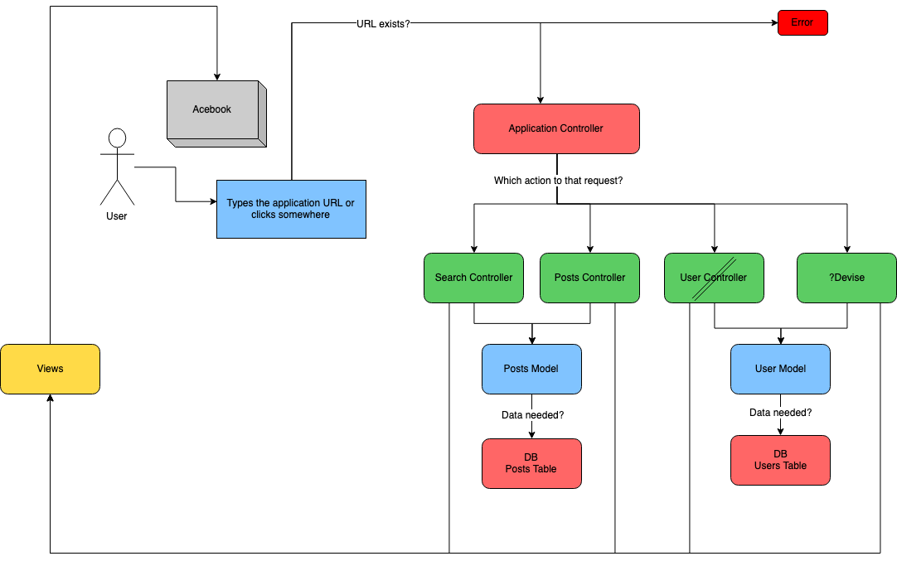

## Description

Our project is part of the Makers Academy week 8 challenge: a Facebook clone.

This is the result: [Steam Acebook](https://steam-acebook.herokuapp.com)

### Team Collaborators

Kiah Hewitt - https://github.com/kiahjade Jordan Roberts - https://github.com/jordantroberts Gui Heurich - https://github.com/guilhe0756 Stuart Pethurst - https://github.com/stuartpet Sarpong Abasimi https://github.com/SarpongAbasimi

# Steam AceBook

[](https://app.codacy.com/app/stuartpet/acebook-steam?utm_source=github.com&utm_medium=referral&utm_content=stuartpet/acebook-steam&utm_campaign=Badge_Grade_Dashboard)
[](https://travis-ci.org/stuartpet/acebook-steam)

## Technologies Used

- Languages: Ruby, SQL
- Framework: Rails
- Feature testing: RSpec and Capybara
- Unit testing: RSpec
- Linter: Rubocop
- CICD: Travis (CI), Heroku (CD)
- Analytics: Simplecov
- Code quality: Codacy

## Quickstart

First, clone this repository. Then:

```
bash
> bundle install
> bin/rails db:create
> bin/rails db:migrate

> bundle exec rspec # Run the tests to ensure it works
> bin/rails server # Start the server at localhost:3000
```

### To run tests

```
rspec
```

### To deploy

Just push any changes to Github, submit a pull request.
Once the pull request is approved, Travis will automatically deploy on Heroku.

## Learning Documentation

During this project, we kept track of what we learned by documenting our meetings, discussions, and specific topics of research. We have recorded this process in this repository's [Wiki page](https://github.com/stuartpet/acebook-steam/wiki)

## MVC Modelling



## How to contribute to this project

See [CONTRIBUTING.md](CONTRIBUTING.md)
