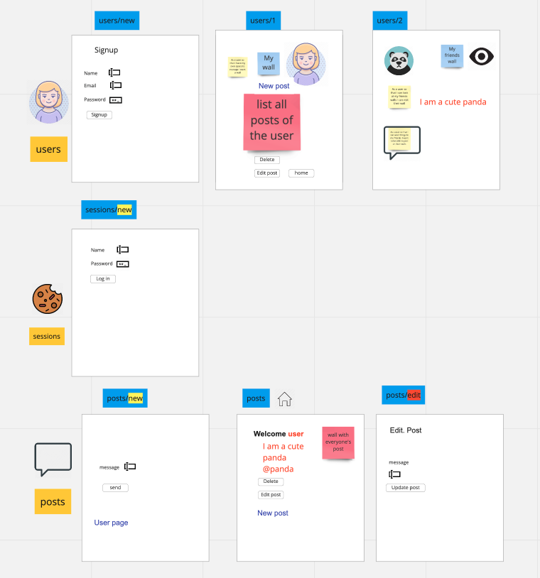
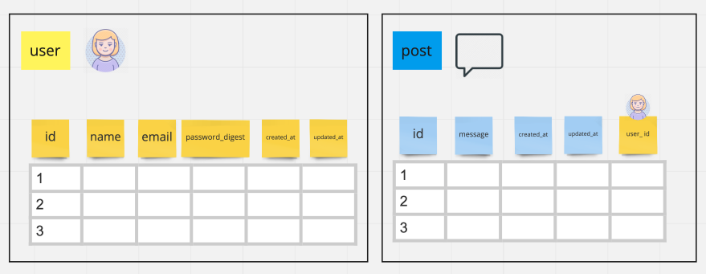

# GAPAC BOOK 

## A project description.
- This project enables **users** to post **posts** 
- Users can view all the posts on the posts home page
- Users have their own  wall where they can view only thier own posts  
- Users can go to others users wall by clicking on another user's tag in the main page 

This project was built using rails.


### Mockup  


### Tables 


## Quickstart


## how to install and run it.
First, clone this repository. Then:

```bash
> bundle install
> bin/rails db:create
> bin/rails db:migrate
> bundle exec rspec # Run the tests to ensure it works
> bin/rails server # Start the server at localhost:3000
```

## How to run tests  
- rspec 
  - run `rspec`
- simplecov 
  - connected to rspec
- rubocop 
  - run `rubocop`
- rubycritic 
  - run `rubocritic`


