# OctoBook

A social network app for Cephalopods, where you can:

- Express yourself in a post
- Share stunning photos
- Support your friends with likes and comments
- See all of a user's posts on their personal profile.

Sign up now and give us your data for free!

## Quickstart

First, clone this repository. Then:

```bash
> bundle install
> bin/rails db:create
> bin/rails db:migrate

> bundle exec rspec # Run the tests to ensure it works
> rails server # Start the server at localhost:3000
> visit http://localhost:3000/ # Enjoy
```

## App preview

http://octobook-team.herokuapp.com/

# User Stories

[User Stories](https://github.com/fraserbrookhouse/acebook-rails-quadropus/wiki/User-stories#viewing-posts)

# Website Wireframes

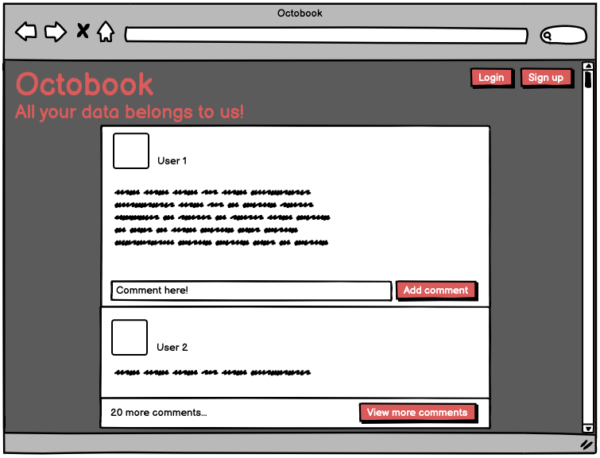
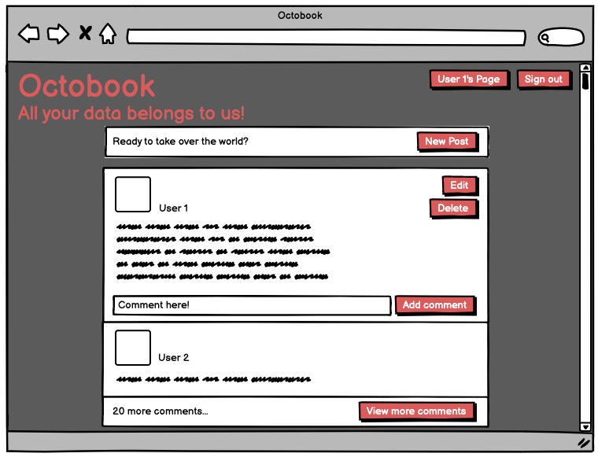
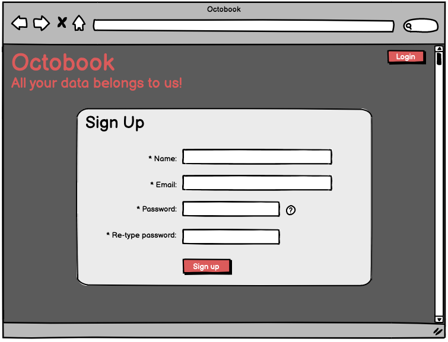
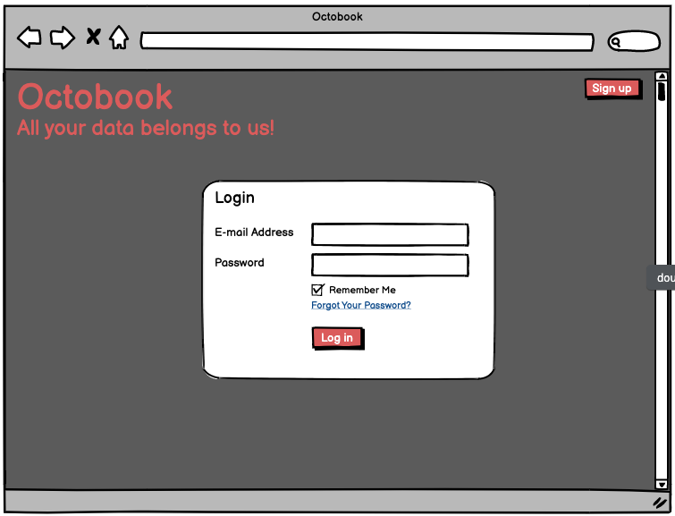
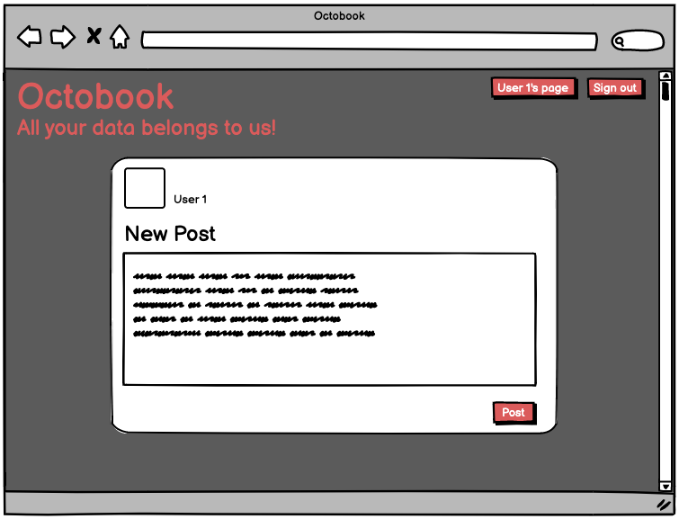
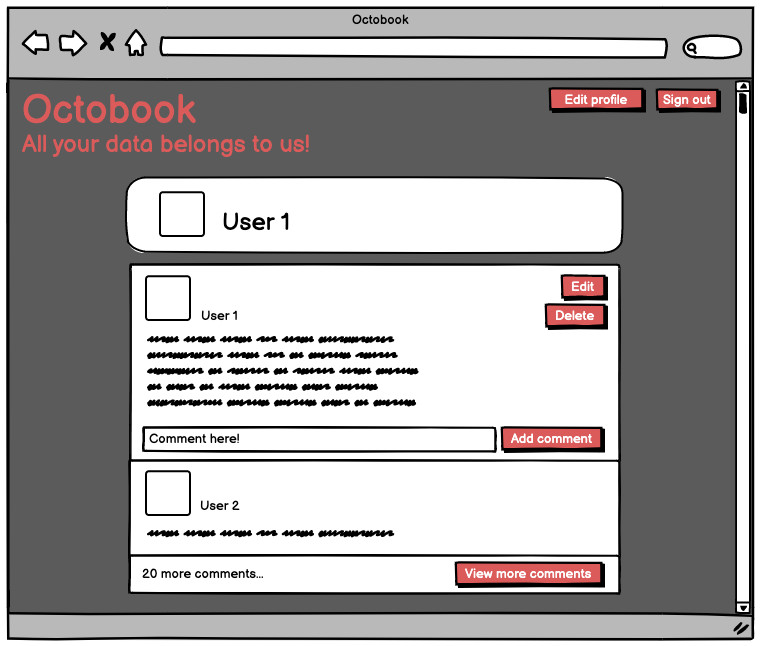
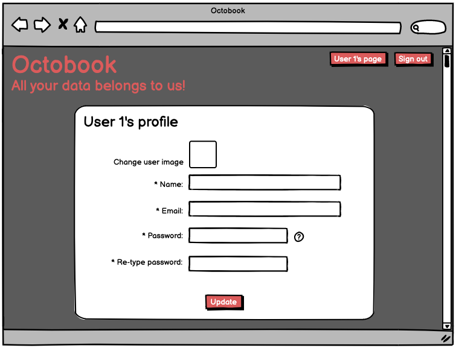

# Website Screenshots
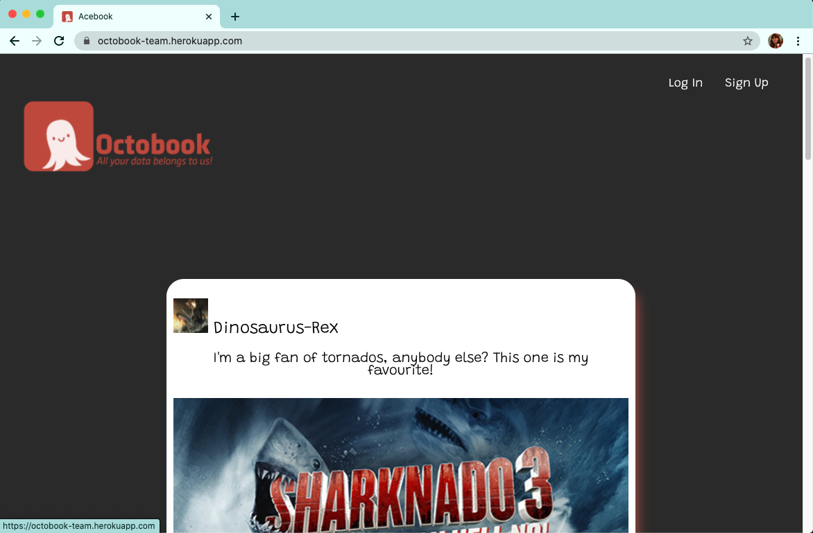
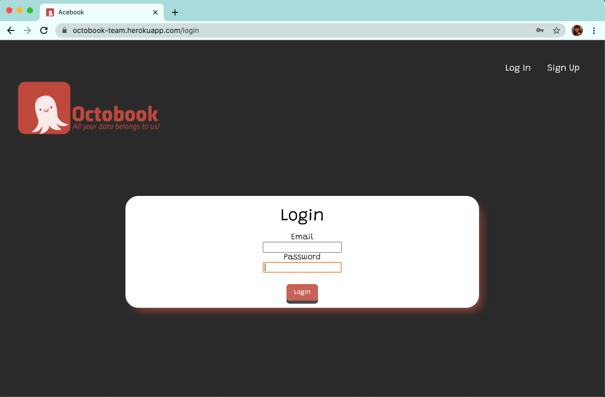
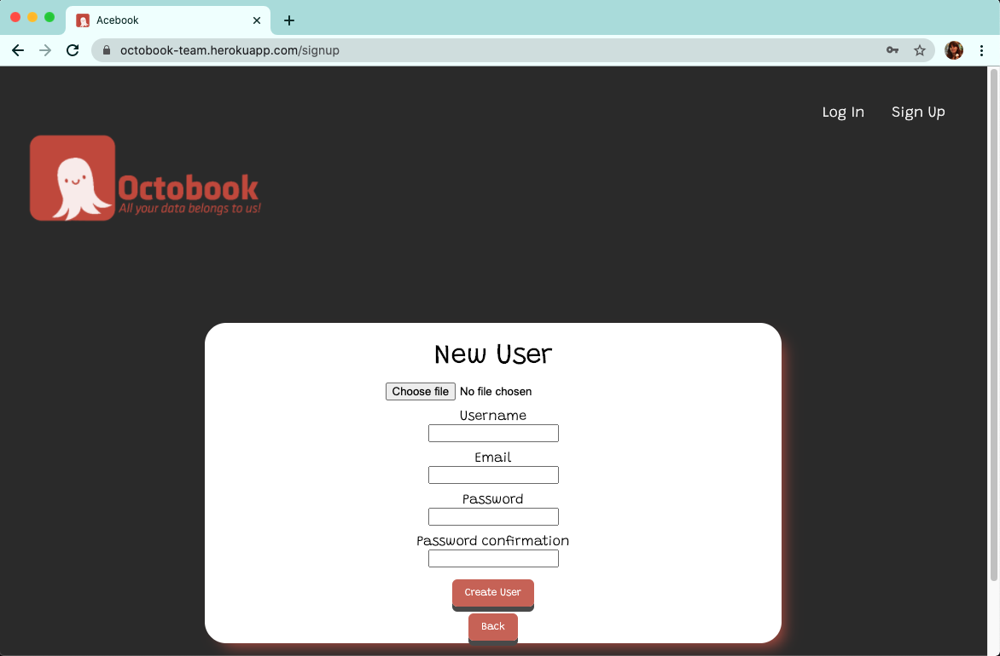
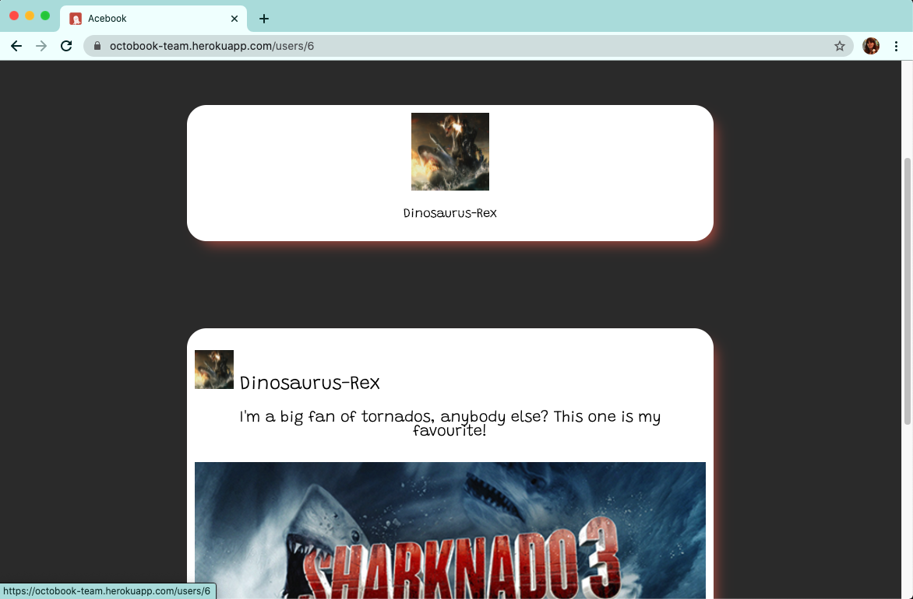
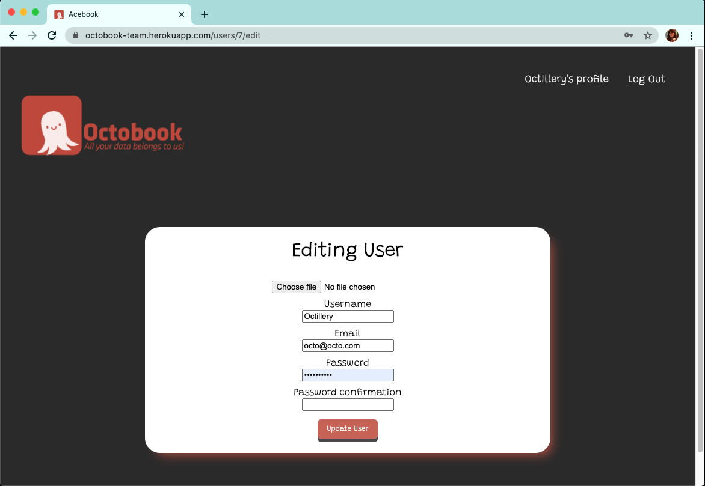
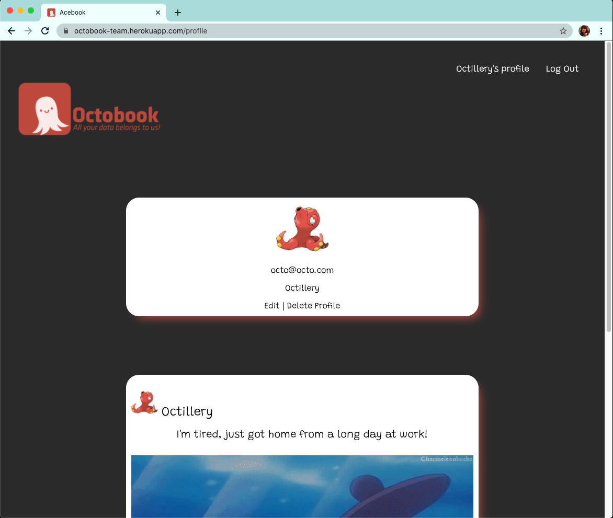
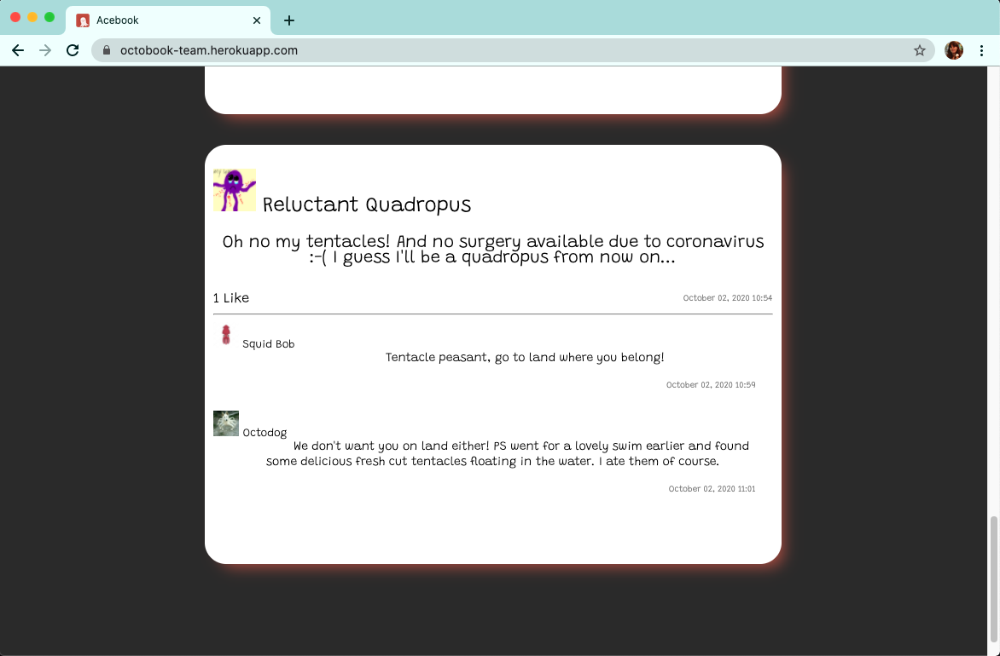

# Additional Notes

Try entering the Konami code for a fun surprise!
