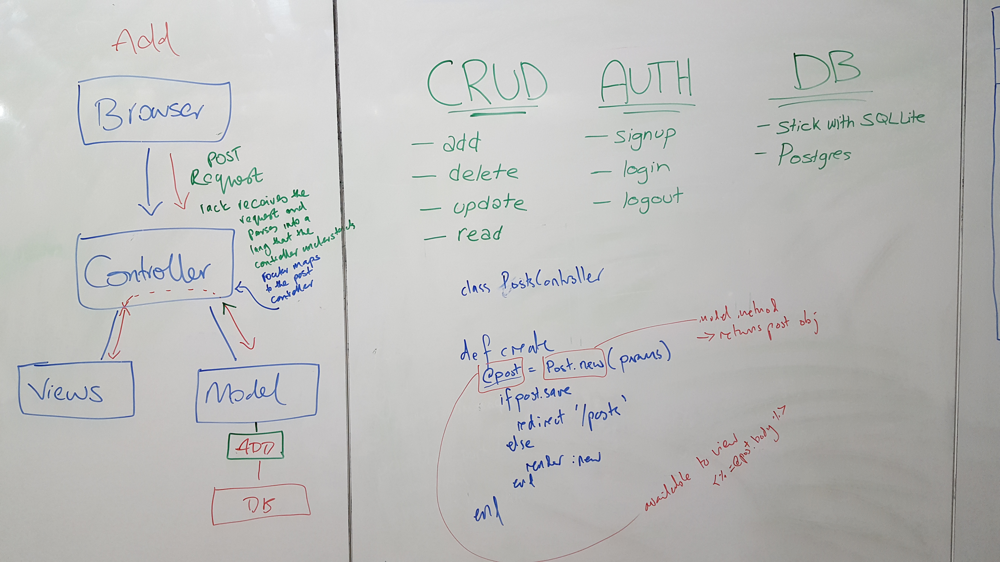
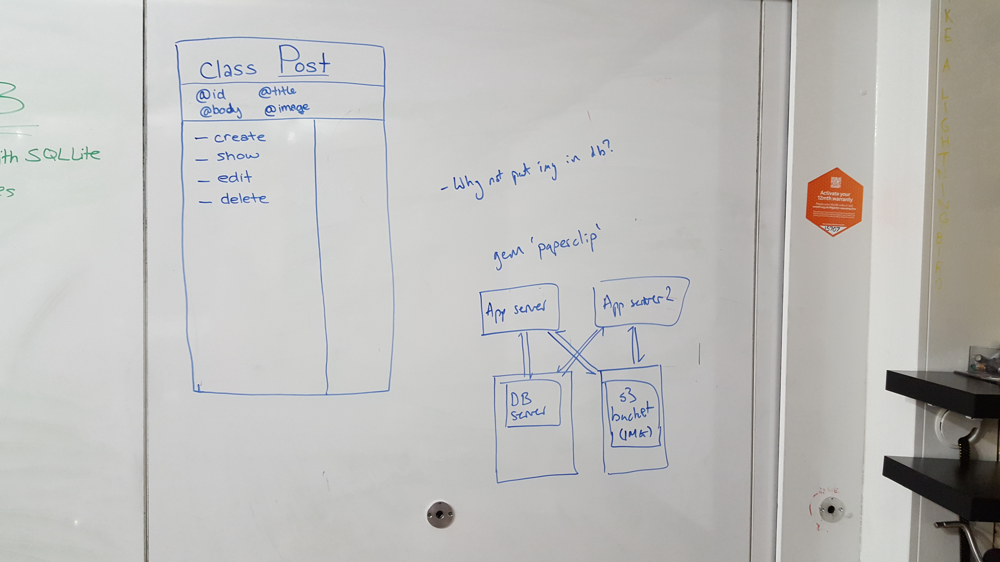
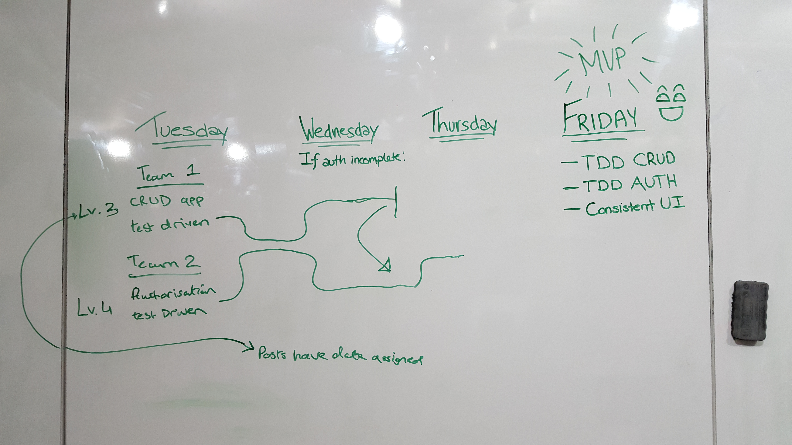

# AceBook - JAID

## Members

- [Asad Khan](https://github.com/AsadK47)
- [Darryl Banks](https://github.com/zombie9)
- [Ijeoma Nelson](https://github.com/githubsttar)
- [Jackie Dunne](https://github.com/kiedunne)


## Trello Board

https://trello.com/b/Fp0JIOMP/acebook-planning-team-jaid

## Instructions

[You can find the engineering project outline here.](https://github.com/makersacademy/course/tree/master/engineering_projects/rails)

## Quickstart

First, clone this repository. Then:

```bash
> bundle install
> bin/rails db:create
> bin/rails db:migrate

> bundle exec rspec # Run the tests to ensure it works
> bin/rails server # Start the server at localhost:3000
```

## Diagrams






