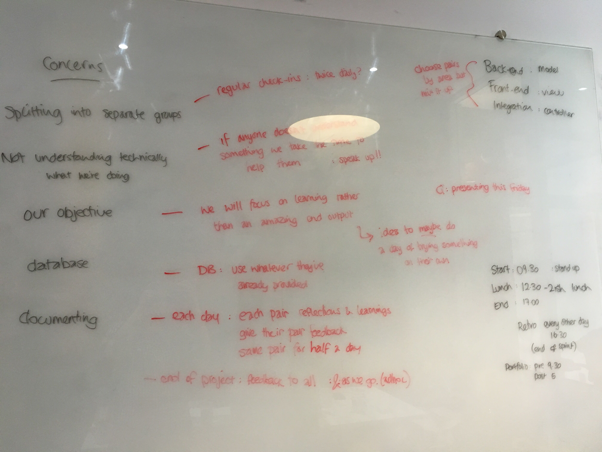
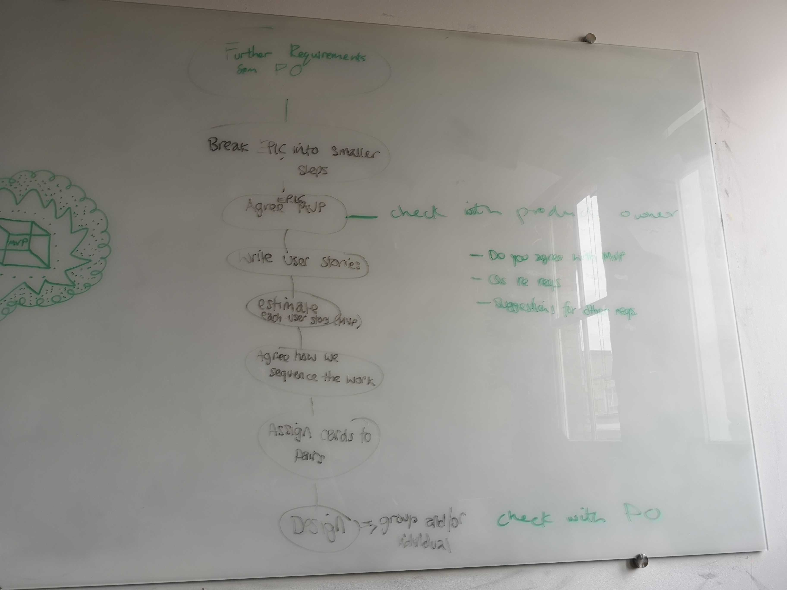
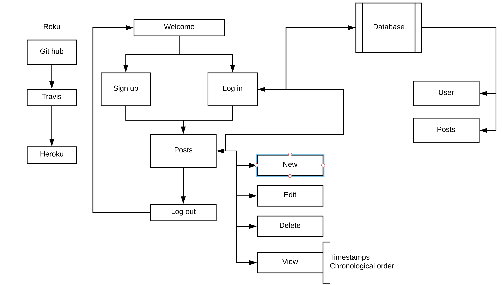

# AceBook - ROKU

[](https://travis-ci.org/samanthaixer/acebook-roku)
[](https://coveralls.io/github/samanthaixer/acebook-roku?branch=master&kill_cache=1)

### Roku - "Six" in Japanese. We are six and we are ninjas!

The ninjas are:
1. Greg - "Leonardo"
2. Harry - "Michaelangelo"
3. Andy - "Raphael"
4. Wardah - April O'Neill
5. Bart - "Krang"
6. Sam - "Donatello" 

## INSTALLATION INSTRUCTIONS:

1. You can install this project by doing the following:

- `git clone git@github.com:samanthaixer/acebook-roku.git`
- `bundle install`

```bash
> bundle install
> bin/rails db:create
> bin/rails db:migrate

> bundle exec rspec # Run the tests to ensure it works
> bin/rails server # Start the server at localhost:3000
```

2. The card wall is here: https://trello.com/b/La8uq2yv/team-roku-acebook-project

3. You can find our application hosted on heroku: [Click here to Go Roku!](https://acebook-roku.herokuapp.com/posts)

## Our approach so far

Please see our file called [group-reflections&learning](https://github.com/samanthaixer/acebook-roku/blob/master/group-reflections%26learning.md) for daily reflections on process and learning.

Before we started as a team, we reflected on the previous team project and used our learnings to help us set out how we want to work together:



We have a regular approach for each sprint:



This shows our routes and how our methods work together to build our webpage.
 
