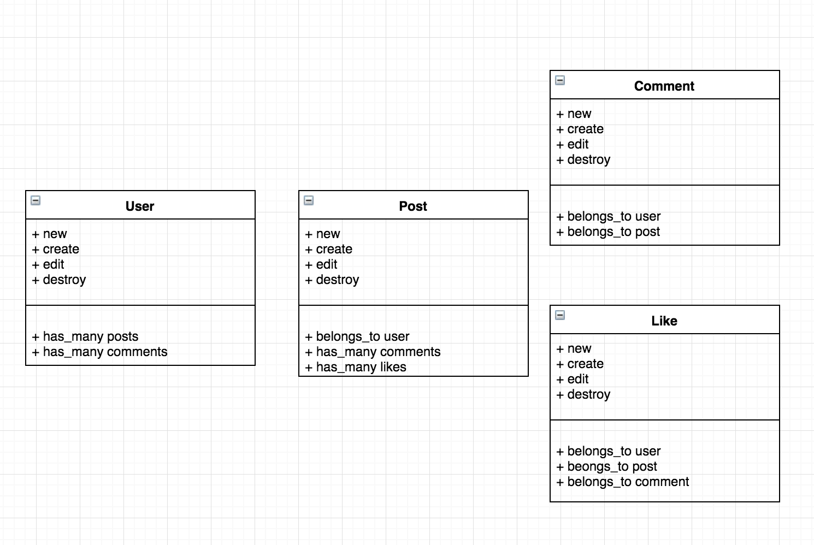

# AceBook 
[](https://travis-ci.org/CazaBelle/acebook-rails-smoking-dragons)

The latest Facebook clone that allows you to keep up to date with all of your friends' latest ramblings.

## Prerequisites
* Rails 5.1.5
* Ruby 2.5.0
* postgresql 11.1

### Installation
* `git clone git@github.com:CazaBelle/acebook-rails-smoking-dragons.git`
* `cd acebook-rails-smoking-dragons`
* `bundle install`
* `bin/rails db:create`
* `bin/rails db:migrate`
* `bundle exec rspec` # Run the tests to ensure it works
* `bin/rails server` # Start the server at localhost:3000

### Built with
|  Tech|  Decription |   
|---|---|
|[Ruby](https://ruby-doc.org/)| Language|
|[Ruby on Rails](https://guides.rubyonrails.org/) |  Web application framework |
|[Active Record](https://guides.rubyonrails.org/active_record_basics.html)  | Database  |  
|[RSPEC](http://rspec.info/)  | Testing framework  |  
|[Capybara](http://teamcapybara.github.io/capybara/)| Feature testing framework|
|[Travis](https://travis-ci.org/)| Continuous integration service|
|[Postgresql](https://www.postgresql.org/)|ORM|

## User Stories
```
As a User,
So I can use Acebook,
I want to be able to sign up
```
```
As a User,
So only I can access my Acebook,
I want to be able to log in.
```
```
As a User,
So I can take a break from AceBook,
I want to be able to log out.
```
```
As a User,
So I can tell other users what I am doing,
I want to be able to post something.
```
```
As a User,
So I can react to other users posts,
I want to be able to like a post.
```
```
As a User,
So I can hide my extreme views
I want to be able to delete a post
```
```
As a User,
So I can better react to other posts,
I want to be able to comment on them.
```
```
As a User,
So I can change my mind on a post,
I want to be able to edit past posts.
```
```
As a User,
So I can see my history,
I want to be able to view all my posts.
```
```
As a User,
So I can judge someone,
I want to be able to see a picture of them on their profile
```
```
As a User,
So I can find new people on Acebook,
I want to be able to view someones elses profile
```
```
As a User,
So I can better know someone by their profile,
I want to see all their previous posts
```
```
As a User,
So I can visit my friend's profile and see their wall,
I want to be able to search for them by name
```
```
As a User,
To maintain my privacy,
No one can see my wall unless they are logged in
```
```
As a User,
So I can interact with my friends,
I can leave posts on my friends' walls
```
```
As a User,
To protect my content,
Only I can edit or delete my posts on any wall
```
```
As a User,
So I can find my friends more easily,
I would like to find them through entering their username in the URL
```
```
As a User,
So I can customise my wall,
I would like to have a choice of backgrounds and fonts
```
```
As a Dev,
So users can use AceBook,
I want to deploy it via Heroku
```
```
As a Dev,
So I know my code always works,
I want to implement Travis continuous integration
```
```
As a Dev,
So I can protect my users,
I want to restrict unregistered users actions to only Sign Up/Log In
```
```
As a Dev,
So my users know why there is an error,
I want to redirect them to a 404 page if a user does not exist.
```
## CRC


## Wireframe


### Minimum Viable Product
  As a group we decided the below requirements would meet our expectation of a minimum viable product that is deployed. We aimed to implement these as a minimum to enhance our learning and produce a working app.
```
- A user can signup for Acebook.
- A User can log in and out of Acebook.
- A User can create, update and delete posts.
- User can comment on their own and others posts.
- A User can Like a post via a button.
- A profile picture is present on users profiles.
```

## Testing
* $`rspec` 

## Deployment
* [Hosted on Heroku](https://acebook-dragons.herokuapp.com)

## Contributing
See [Contributing.md](https://github.com/CazaBelle/acebook-rails-smoking-dragons/blob/master/CONTRIBUTING.md) to contribute

## Authors
* [Georges Le Vaillant](https://github.com/stonefarmer9)
* [Onkar Sahota](https://github.com/OSSahota)
* [Jacques Laffy](https://github.com/jlaffbabs)
* [Carol Gardiner](https://github.com/CazaBelle?tab=repositories)
