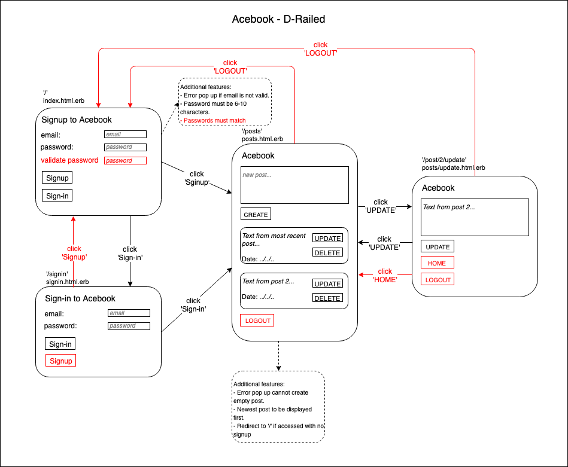

# AceBook

*Co-authored by: Lucy Barber, Magnus Arbuthnott, Ollie Brownlow, Vlad Chiriac, Edina Bolkeny, Cosmin Catalin Croitoriu*

*Read this repo's wiki for our development process*

[](https://travis-ci.org/marbuthnott/acebook-d-railed)

## INTRODUCTION

The aim of this project was to use high quality processes to build a ruby on rails full stack web application within a team.

The requirement was to build a facebook clone where a user can signup, write, update, and delete posts, and view posts from all users. In addition to the web application's user stories we were required to approach the build with the Agile project management methodology.

The project is provided by Makers Academy as week eight's group challenge; this provides the learning base for Ruby on Rails and the Agile project management process.

## GETTING STARTED

1. Fork/clone this repository using `git clone https://github.com/marbuthnott/acebook-d-railed`

2. Run in the terminal from the root directory -

```
bundle install
rails db:create
rails db:migrate

rspec # Run the tests to ensure it works
rails server # Start the server at localhost:3000
```

## ON HEROKU

Visit https://acebook-d-railed.herokuapp.com

Interact as per below:

## HOW TO USE THE APP
- Visit the root page and sign up with email and password. If you already have an account, follow the 'Sign in' link

- Click 'New post' to add a post

- Enter your post into the field and click 'Submit'

- If you would like to edit your post click 'Edit' (act quick - you can only do this within 10 minutes of creating the post!)

- If you would like to delete your post click 'X'

## USER STORIES

Signing up
```
As a user
So I can start creating posts
I want to be able to sign up with my email address and password

As a user
So I know I have entered a valid email address
I want to see an error message explaining why the address is invalid

As a user
So I know I have entered a valid password
I want to see an error message explaining why the password is invalid

As a user
So I know I have signed up
I want to see a message telling me I have been successful

As a user
To ensure I am signed up before using the app
I want to be redirected to the signup page if I visit another URL
```

Signing in
```
As a signed-up user
So I can continue using Acebook
I want to be able to sign in with my email address and password

As a signed-up user
So I know if I have entered my password correctly
I want to see an error message explaining that the password and my email do not match

As a signed-up user
So I know if I have entered my email correctly
I want to see an error message explaining that my email does not match to any in the current records

As a signed-up user
To ensure I am signed in before using the app
If I visit another URL, I want to be redirected to the signup page where I will see a link to the sign in page
```

Managing posts
```
As a signed-in user
So that I can write longer posts
I can write posts with multiple lines

As a signed-in user
So that I can see the most recent posts first
I can see all posts in reverse chronological order

As a signed-in user
So that I know when a post was made
I can see the date and time a post was created/updated

As a signed-in user
So that I can manage my posts
I want to be able to update posts for a maximum of 10 mins after it was created

As a signed-in user
So I don't accidentally update another user's post
I will see an error if I try to update a post not made my myself

As a signed-in user
So that I can manage my own posts
I want to be able to delete a post

As a signed-in user
So that I don't accidentally delete another users post
I will see an error message if I try to delete another users post
```  

## TECH/FRAMEWORK USED

**Primary programming language:** *Ruby on Rails*, or Rails, is a server-side web application framework written in Ruby. Rails is a model–view–controller framework, providing default structures for a database, a web service, and web pages.

**Other programming languages:** *HTML/CSS* is used for styling in the browser.


Bootstrap/Javascript section here?


**Unit testing framework:** *RSpec* is a Behaviour Driven Development for Ruby, run from the command line.

**Feature testing framework:** *Capybara* is used to test web applications by simulating how a real user would interact with your app. Runs off RSpec commands in the terminal.

**ORM:** *Active record* facilitates the creation and use of objects whose data requires persistent storage to a database.

**CI/CD:** *Travis CI* is a hosted continuous integration service used to build and test software projects hosted at GitHub. It can also be used as part of the pipeline to automatic deployment on Heroku.

**Cloud platform:** *Heroku* is a platform as a service (PaaS) that enables developers to build, run, and operate applications entirely in the cloud.

## MODELS/IMAGES

FEATURE MODEL:


(note ==> 'red' are additional features not included in user stories)
